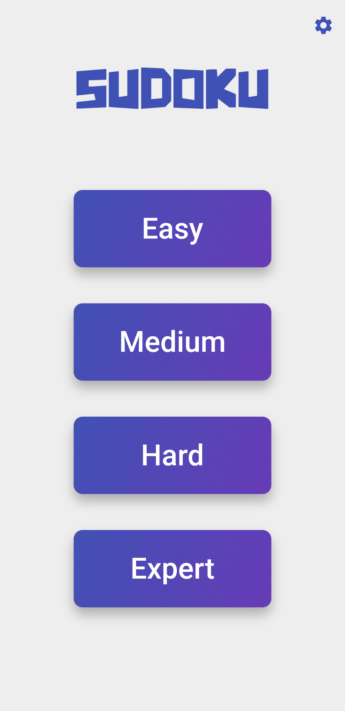
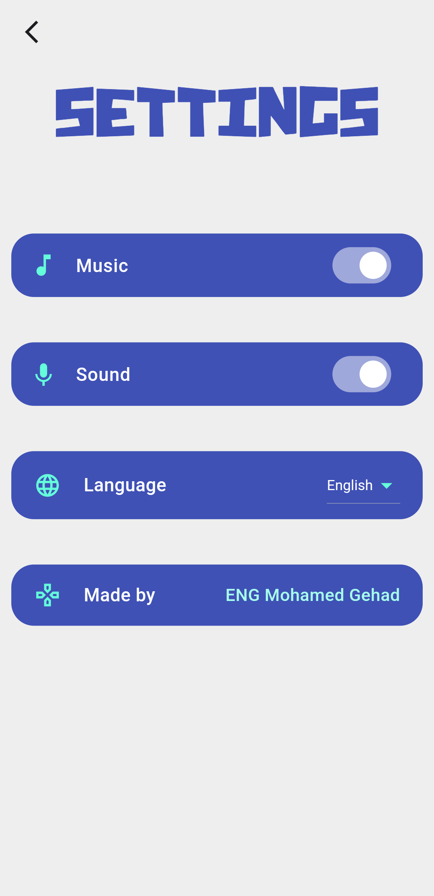
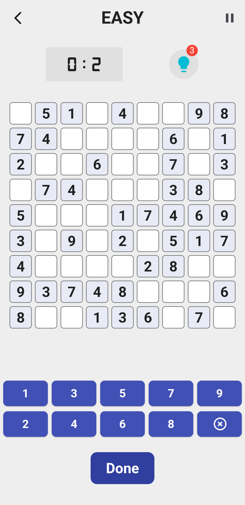
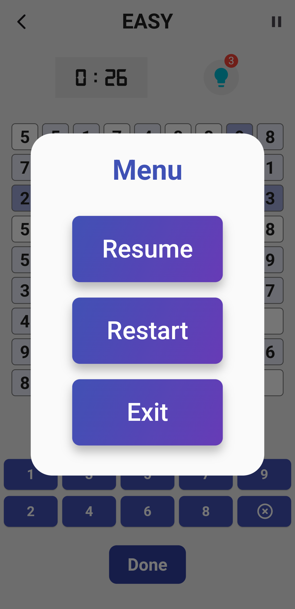
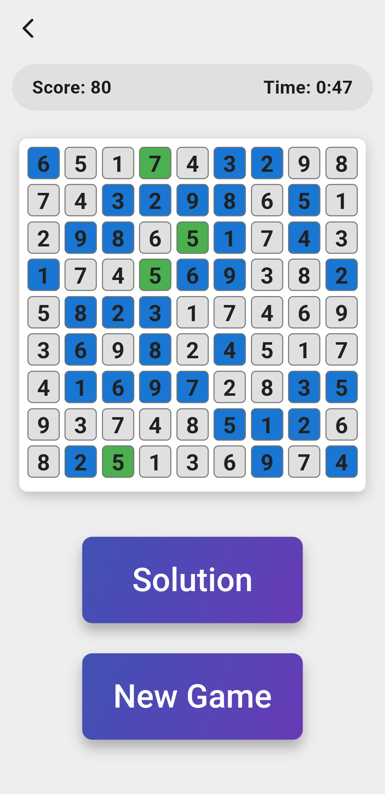

# Sudoku Flutter App

A sleek and user-friendly Sudoku game built using Flutter. Choose your difficulty level, play with or without music, and challenge yourself to solve puzzles in record time.


## Table of Contents

- [Features](#features)
- [Screenshots](#screenshots)
- [Installation](#installation)
- [Usage](#usage)
- [Contributing](#contributing)
- [Technology Stack](#technology-stack)
- [Future Enhancements](#future-enhancements)
- [Contact Information](#contact-information)

## Features

| Feature                        | Description                                          |
| ------------------------------ | ---------------------------------------------------- |
| **Difficulty Levels**          | Easy, Medium, Hard, Expert                           |
| **Sound Settings**             | Toggle music and sound effects                       |
| **Language Support**           | Multi-language support                               |
| **User Interface**             | Clean and intuitive UI                               |
| **Completion Feedback**        | View score, time, and solution upon game completion  |

## Screenshots

### Home Screen


### Settings Screen


### Game Screen


### Pause Screen


### Game Completion Screen



## Installation

1. **Clone the repository:**
   ```sh
   git clone https://github.com/MGehad/Sudoku_Game.git
   ```

2. **Navigate to the project directory:**
   ```sh
   cd Sudoku_Game
   ```

3. **Install dependencies:**
   ```sh
   flutter pub get
   ```

4. **Run the app:**
   ```sh
   flutter run
   ```
  

## Usage

1. Launch the app on your device.
2. Select your desired difficulty level from the home screen.
3. Solve the Sudoku puzzle by filling in the blanks with numbers 1-9.
4. Use the settings screen to toggle music, sound effects, and change the language.
5. After completing the puzzle, view your score, time, and the solution.

## Contributing

Contributions are welcome! Please follow these steps to contribute:

1. Fork the repository
2. Create a new branch (`git checkout -b feature/your-feature-name`)
3. Commit your changes (`git commit -m 'Add some feature'`)
4. Push to the branch (`git push origin feature/your-feature-name`)
5. Open a Pull Request

## Technology Stack

- **Framework:** Flutter
- **Language:** Dart

## Future Enhancements

- Add more language support
- Implement daily challenges
- Add social media sharing options for scores

## Contact Information

**Developed by:** ENG Mohamed Gehad  
**GitHub:** [MGehad](https://github.com/MGehad)  
**Email:** [ENGMGehad@gmail.com](mailto:ENGMGehad@gmail.com)
